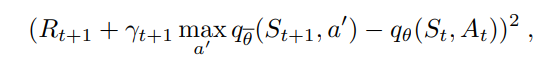
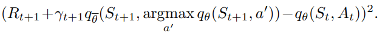
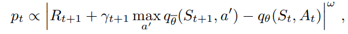
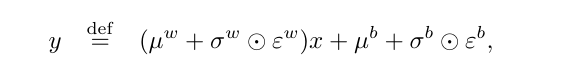
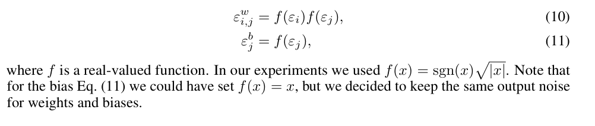
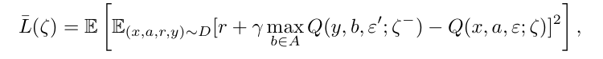
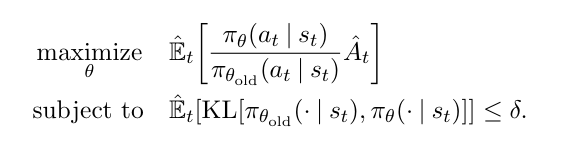
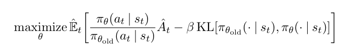
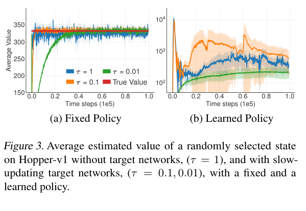

## Implementation detail

- We'll mimick stablebaseline API: model = DQN(env, args)
- model.train(step=1000)
- model.predict(input)

## DQN

- choose the maximum max(Q_target(S_t+1, a'), a') based on params of Q_target

## DDQN: 

- improve DQN by decouple the action selection process from it's evalution, 
- We use argmax(Q_value(S_t+1, a'), a') to choose the action, not Q_target
- Reduce harmful overestimations by the max() operator

## Prioritized replay

- Sample transitions from which there is much to learn
- Probability of transition pt is based on the diff between max(q_target(s_t+1, a')) - q_value(s_t, a)
- We then raise pt by omega w, w is a hyperparameter that control the shape of the distribution

## Noisy Net
- most exploration heuristics rely on random perturbations of the agent's policy (epsilon greedy)
- unlikely to lead to the large-scale behavioural patterns needed for efficient exploration in many environments
- Optimism in the face of uncertainty is a common heuristic in RL that has better performance but not easily applied
with more complicated function approximators
- augment the environment’s reward signal with an additional intrinsic motivation term that reward novel discoveries:
    - separate the mechanism of generalisation from exploration
    - weighting relative to reward must be chosen by experimentals, may introduce bias to the policy
- NoisyNet: learned pertubations of the network weights are used to drive exploration
- The key insight is that a single change to the weight vector can induce a consistent, 
and potentially very complex, state-dependent change in policy over multiple time steps
- noise is added to the policy at every step, pertubations are sampled from a noise distribution
- variance of the pertubation is a parameter that can be considered as the energy of the injected noise
- double the parameters in the linear layers. weights are simple affine transform of the noise.
- computation complexity still dominated by mat mul, not weights generation
- noisy net: phi = mu + sigma * epsilon (element-wise mul), mu and sigma are learnable params, epsilon is a 
zero-mean vector of noise with fixed statistics
- we replace the normal linear layer wx+b by:

- all of this operations are just affine transformation (element-wise mul and addition)
- they use factorised Gaussian: p unit of Gaussian vars epsilon_i for input noises and q unit Gaussian noise
for outputs (total = p + q vars)

- fc layers of value net are parameterised as a noisy net, parameters are drawn from the noisy net param distribution

- note the different noise used in two networks: avoid bias

## PPO

- Optimize multiple steps of policy gradient loss using the same trajectory is not well-justified, empricially
leads to destructive large policy updates
- TRPO: maximize a surrogate objective function subject to a constraint of the size of policy update

- We can rewrite TRPO to solving the unconstrained optimization problems

- Certain surrogate objective forms a lower bound on the performance of policy
- Choose beta is hard, experiments showed
- PPO: modify the objective, penalize changes to the policy that move r(theta) away from 1

## TD3

- Overestimation bias and the accumulation of error in temporal difference methods are present in an actor-critic setting
- This inaccuracy is further exaggerated by the nature of temporal difference learning
- Estimate of the value function is updated using the estimate of a subsequent state
- Using an imprecise estimate within each update will lead to an accumulation of error.
- DDQN is ineffective against actor-critic setting due to slow-changing policy -> current and target
value estimates remain too similar
- Use Double Q-learning to deal with this problem: using a pair of independently trained critics
- Unbiased estimate with high variance can still lead to future overestimations in local regions of state space
- Propose Clipped Double Q-learning: value estimate suffering from overestimation bias can be used as an 
approximate upper-bound to the true value estimate -> favors underestimations, do not tend to be propagated during learning,
as actions with low value estimates are avoided by the policy

### Overestimation Bias in Actor-Critic

- Policy is updated with respect to the value estimates of an approximate critic
- overestimation may be minimal with each update, the presence of error raises two concerns:
  - may develop into a more significant bias over many updates if left unchecked
  - inaccurate value estimate may lead to poor policy updates
- Double Q learning: greedy update is disentangled from the value function by maintaining two separate value estimates
- Use a pair of actors (pi1, pi2) and critics (q1, q2)

### Target Networks and Delayed Policy Updates

- Stable target reduces the growth of error, provide a stable objective in the learning procedure
- Without a fixed target, each update may leave residual error which will begin to accumulate
- Fixed policy + slow updating target network -> stable learning process of value network

- Divergence that occurs without target networks is the result of policy updates with a high variance value estimate
- If target networks can be used to reduce the error over multiple updates, and policy updates on high-error states cause
divergent behavior, then the policy network should be updated at a lower frequency than the value network
-> Delaying policy updates until the value error is as small as possible

### Target Policy Smoothing Regularization

- Deterministic policies can overfit to narrow peaks in the value estimate
- Update the critic with a learning target using a deterministic policy increase the variance of the target
-> We need regularization
- Enforce similar actions should have similar value
- Fitting the value of a small area around the target action
-> Adding a small noise

# R2D2

- Built upon prioritized distributed replay and n-step double Q-learning (n=5)
- Generate experiences by a large number of actors (n=256) and learning from batches of exp by a single learner
- Store fixed-length (n=80) sequences of (s, a, r), adjacent sequences overlapping each other by 40 time steps, never crossing episode boundaries
- In training, unroll both online and target networks on the same sequence of states to generate value estimates and targets
- Uses an invertible value fn rescaling of the form h(x) = sign(x)(sqrt(abs(x+1) - 1)) + epsilon*x
- In order to achieve good performance in a partially observed environment, an RL agent requires
a state representation that encodes information about its state-action trajectory in addition to its
current observation
- Most common way is to use an RNN, as part of the agent's state encoding
- To train RNN to learn meaningful long-term dependencies, whole state-action trajectories need to be stored in replay buffer
- Training strategy: using a zero start state to initialize the network at the beginning of sampled sequences:
    - allows independent decorrelated sampling of relatively short sequences
    - it forces the RNN to learn to recover meaningful predictions from an atypical initial recurrent state
    - may limit its ability to fully rely on its recurrent state and learn to exploit long temporal correlations
- Representational Drift: learned representations of states produced by the recurrent neural network (RNN) evolve during training because network parameters change as it learns
-> Same input state to be represented differently at different points in training
-> Q-value predictions no longer align well with current policy or value fn
- Solution: maintaining a fixed target network (q-network)
- Burn-in: process a sequence of states preceding a relayed exp to warm up it's hidden state to match the context at the time the exp occurred

- Recurrent State Staleness: RNNs maintain hidden states that depend on a sequence of observations
    - With exp replay, the hidden states at the time an exp was collected are not stored in the buffer
    - During training, RNN must recreate them by reprocessing the sequence of observations but it not perfectly replicate the original hidden states due to network params change
Solution: Burn-in: to recreate a hidden state close to what it would have been during the original experience collection
- trains on sequences of experiences to preserve temporal context instead of training on individual transitions